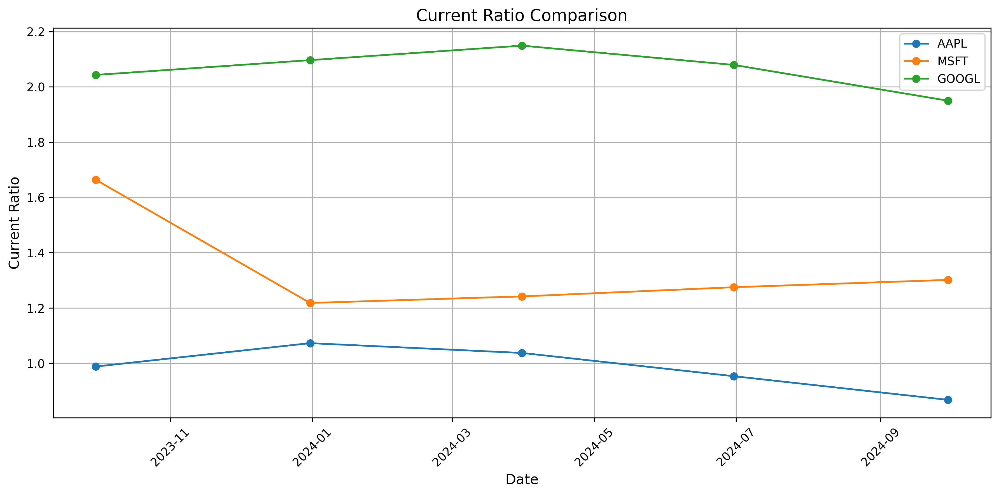
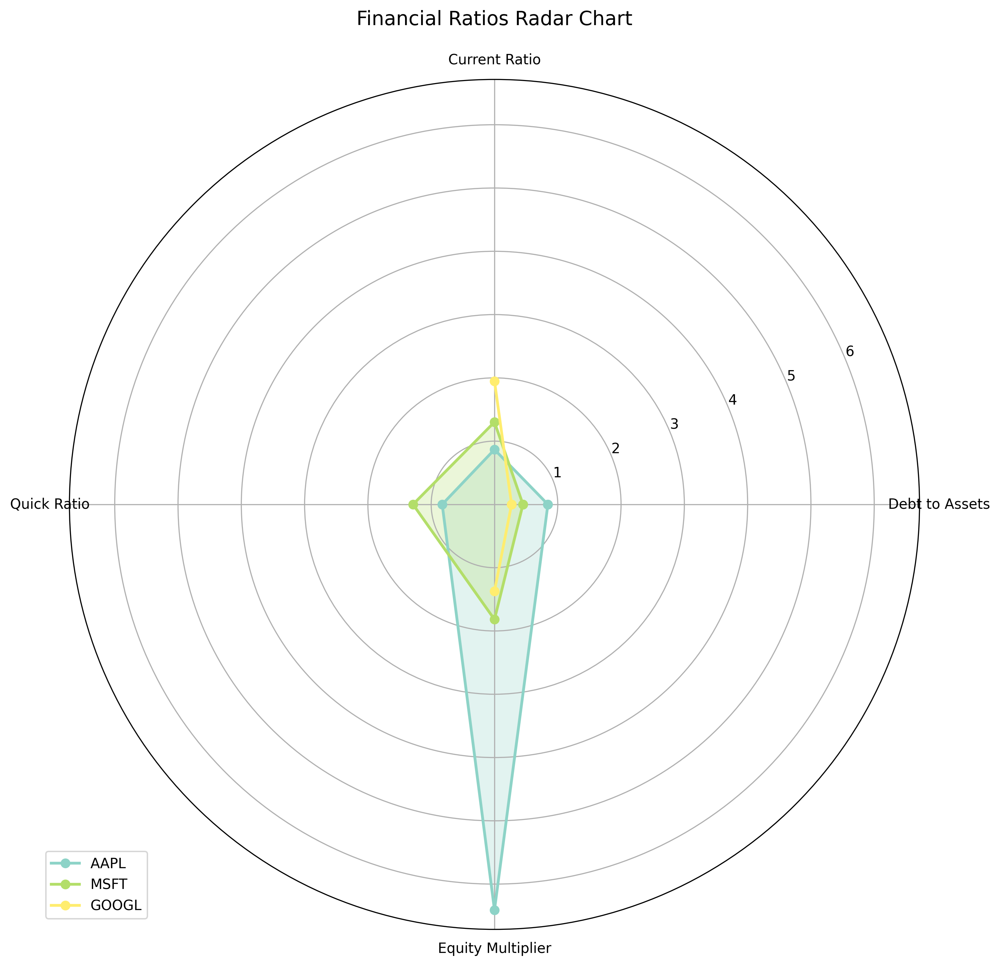
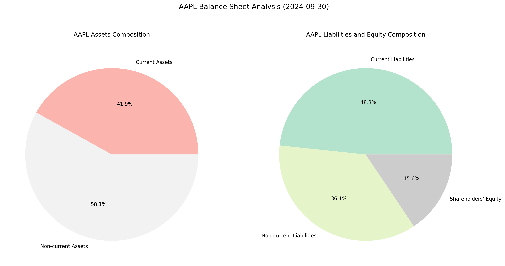

# financial-statement-analysis

# Financial Analysis Dashboard

A comprehensive financial analysis tool that automates the process of analyzing quarterly financial statements for multiple public companies. The tool fetches real-time data, calculates key financial ratios, generates visualizations, and provides detailed analysis reports.

## Output Examples

### Current Ratio Comparison

*Comparison of current ratios across different companies over time, showing liquidity trends.*

### Financial Ratios Radar Chart

*Radar chart comparing key financial ratios across companies, providing a comprehensive view of financial health.*

### Balance Sheet Composition

*Example of balance sheet composition analysis for Apple, showing asset and liability distribution.*

## Features

- **Automated Data Collection**: Fetches quarterly balance sheet data from Yahoo Finance
- **Financial Ratio Analysis**: Calculates key financial metrics including:
  - Current Ratio
  - Quick Ratio
  - Debt to Assets Ratio
  - Equity Multiplier

- **Data Visualization**:
  - Current Ratio Comparison Charts
  - Financial Ratios Radar Charts
  - Balance Sheet Composition Analysis
  - Interactive Visualizations using Matplotlib and Seaborn

- **Automated Reporting**: Generates comprehensive financial analysis reports with:
  - Key Financial Ratios Analysis
  - Trend Analysis
  - Risk Assessments
  - Custom Recommendations

## Installation

Clone the repository:
```bash
git clone https://github.com/ZhongyuXie921/financial-analysis-analysis.git
cd financial-analysis-analysis
```

## Usage

1. Modify the company list in `main()` function to analyze your desired companies:
```python
companies = ['AAPL', 'MSFT', 'GOOGL']  # Replace with your desired stock symbols
```

2. Run the analysis:
```bash
python main.py
```

3. Find the outputs in the `output` directory:
- Financial analysis report: `output/financial_analysis_report.txt`
- Visualizations: `output/plots/`

## Dependencies

- pandas
- numpy
- matplotlib
- seaborn
- yfinance
- datetime

## Project Structure

```
financial-analysis-dashboard/
├── main.py                                    # Main script with FinancialAnalysis class
├── current_ratio_comparison.png               # Current ratio visualization
├── debt_ratio_radar.png                      # Financial ratios radar chart
├── AAPL_balance_sheet_composition.png        # Apple's balance sheet visualization
├── MSFT_balance_sheet_composition.png        # Microsoft's balance sheet visualization
├── GOOGL_balance_sheet_composition.png       # Google's balance sheet visualization
├── financial_analysis_report.txt             # Generated analysis report
├── requirements.txt                          # Project dependencies
└── README.md                                 # Project documentation
```

## Features in Detail

### 1. Data Collection
- Automated fetching of quarterly balance sheet data
- Error handling for missing or incomplete data
- Support for multiple companies

### 2. Financial Ratio Analysis
- Current Ratio for liquidity assessment
- Quick Ratio for immediate liquidity analysis
- Debt to Assets Ratio for leverage analysis
- Equity Multiplier for financial leverage evaluation

### 3. Visualization Capabilities
- Time series analysis of financial ratios
- Radar charts for multi-company comparison
- Balance sheet composition analysis
- Trend analysis visualization

### 4. Report Generation
- Comprehensive financial analysis
- Trend identification
- Risk alerts
- Custom recommendations based on financial metrics

## Contributing

Contributions are welcome! Please feel free to submit a Pull Request.


## Acknowledgments

- Yahoo Finance API for financial data
- Python financial analysis community
- Contributors and maintainers

## Contact

If you have any questions or suggestions, please open an issue or contact zhongyuxie921@gmail.com.

---
**Note**: This tool is for educational and research purposes only. Always verify financial data and consult with financial professionals before making investment decisions.
